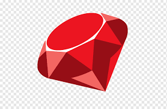

# Frined List App

### Table of Contents

- [Prerequisites](#prerequisites)
- [Tech Stack](#Tecg-Stack)
- [Getting Started](#Getting-Started)
- [Project Structure](#Project-Structure)
- [Deployment](#Deployment)

#

### Prerequisites

-  Ruby @ 3.3.4 and up
-  Bundler @ 2.5.17 and up
-  SQLite @ 1.4 and up (for development and testing)

#

### Tech Stack

-  Rails @ 7.2.0 - A web application framework written in Ruby.

-  Sprockets Rails - Asset pipeline for managing JavaScript and CSS.

-  Puma @ 5.0 - A web server for Ruby/Rails applications.

-  Importmap Rails - Manage JavaScript modules without a bundler.

-  Turbo Rails - Speed up page loads with Turbo Drive and Frames.

-  Stimulus Rails - JavaScript framework for adding interactivity.

-  JBuilder - Build JSON responses in Rails.

-  Devise @ 4.9 - Flexible authentication solution for Rails.

-  TZInfo Data - Timezone data for Rails applications.

-  Bootsnap - Speed up boot time of Ruby applications.

#

### Getting Started

1. First of all you need to clone app repository from Github :

```
git clone https://github.com/YourUsername/friend-list-app.git
```

2. Next step requires install the required gemss.

```
bundle install

```

3. Set up your database

```
rails db:create
rails db:migrate
```

4. Start the Rails server

```
rails server

```

#

### Project Structure

```
app
├── assets          # Static assets (images, fonts, etc.)
├── channels        # WebSocket channels for real-time features
├── controllers     # Controllers for handling requests
├── helpers         # Helper methods used in views
├── javascript      # JavaScript and frontend assets
├── jobs            # Background jobs for asynchronous processing
├── mailers         # Mailers for sending emails
├── models          # Models representing application data
├── views           # Views for rendering HTML
bin
├── brakeman
├── bundle
├── bundle.cmd
├── docker-entrypoint
├── importmap
├── rails
├── rake
├── rubocop
├── setup
config
├── environments    # Environment-specific configurations
├── initializers    # Application configuration settings
├── locales         # Translation files for internationalization
db
├── migrate         # Database migration files
lib
├── tasks           # Custom rake tasks
log                # Application logs
public             # Static files served by the server
test
├── fixtures        # Test fixtures
└── system          # System tests
Gemfile             # Gem dependencies
Gemfile.lock        # Locked gem versions
config.ru           # Rack configuration file
Rakefile            # Rake task definitions
README.md           # Project documentation

###

This README template provides a clear structure and instructions for setting up and understanding your Frins List project. Adjust the sections and details according to your specific project setup and requirements.
```
